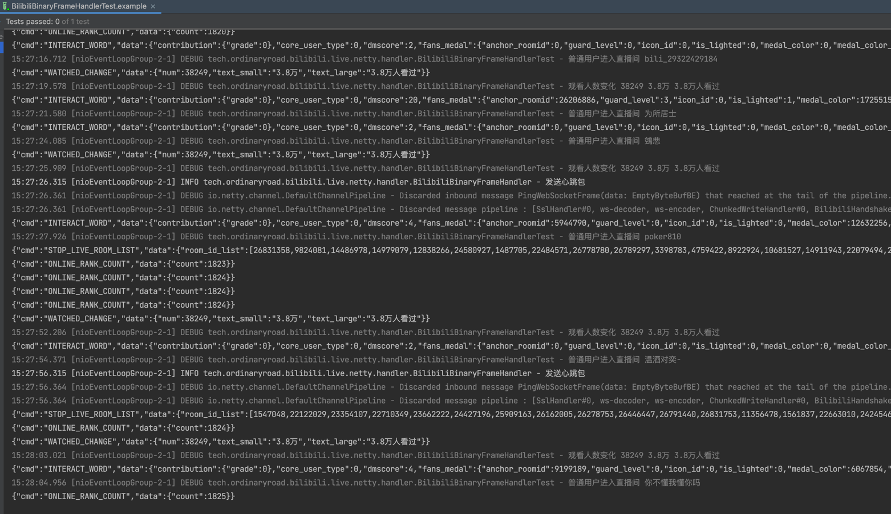

# ordinaryroad-bilibili-live

使用Netty来连接B站直播间的弹幕信息流Websocket接口

- Feature 0: Netty
- Feature 1: 消息中的未知属性统一放到单独的MAP中

example请看`BilibiliBinaryFrameHandlerTest`测试类

修改创建认证包方法的参数后（直播间真实id，可能跟url中的短id不同）运行查看效果

可使用`GET`
方法调用[https://api.live.bilibili.com/room/v1/Room/room_init?id=](https://api.live.bilibili.com/room/v1/Room/room_init?id=${id})
接口获取直播间的真实id

> 创建发送认证包

> 控制台输出示例

> 注：目前protover仅支持2（普通包正文使用zlib压缩）

### Bilibili协议编解码工具类`BilibiliCodecUtil`

```java
public class BilibiliCodecUtil {

    public static final short FRAME_HEADER_LENGTH = 16;

    public static ByteBuf encode(BaseBilibiliMsg msg) {
        ByteBuf out = Unpooled.buffer(100);
        String bodyJsonString = msg.toString();
        byte[] bodyBytes = bodyJsonString.getBytes(StandardCharsets.UTF_8);
        int length = bodyBytes.length + FRAME_HEADER_LENGTH;
        out.writeInt(length);
        out.writeShort(FRAME_HEADER_LENGTH);
        out.writeShort(msg.getProtoverEnum().getCode());
        out.writeInt(msg.getOperationEnum().getCode());
        out.writeInt(BaseBilibiliMsg.sequence++);
        out.writeBytes(bodyBytes);
        return out;
    }

    public static BaseBilibiliMsg decode(ByteBuf in) {
        int length = in.readInt();
        short frameHeaderLength = in.readShort();
        short protoverCode = in.readShort();
        int operationCode = in.readInt();
        int sequence = in.readInt();
        int contentLength = length - frameHeaderLength;
        byte[] inputBytes = new byte[contentLength];
        in.readBytes(inputBytes);

        OperationEnum operationEnum = OperationEnum.getByCode(operationCode);
        if (protoverCode == ProtoverEnum.NORMAL_ZLIB.getCode()) {
            switch (operationEnum) {
                case SEND_SMS_REPLY -> {
                    // Decompress the bytes
                    Inflater inflater = new Inflater();
                    inflater.reset();
                    inflater.setInput(inputBytes);
                    ByteArrayOutputStream byteArrayOutputStream = new ByteArrayOutputStream(contentLength);
                    try {
                        byte[] bytes = new byte[1024];
                        while (!inflater.finished()) {
                            int count = inflater.inflate(bytes);
                            byteArrayOutputStream.write(bytes, 0, count);
                        }
                    } catch (DataFormatException e) {
                        throw new RuntimeException(e);
                    }
                    inflater.end();

                    return decode(Unpooled.wrappedBuffer(byteArrayOutputStream.toByteArray()));
                }
                case HEARTBEAT_REPLY -> {
                    BigInteger bigInteger = new BigInteger(inputBytes, 0, 4);
                    return parse(operationEnum, "{\"popularity\":%d}".formatted(bigInteger));
                }
                default -> {
                    System.out.println("operationCode = " + operationCode);
                    String s = new String(inputBytes, StandardCharsets.UTF_8);
                    return parse(operationEnum, s);
                }
            }
        } else if (protoverCode == ProtoverEnum.NORMAL_NO_COMPRESSION.getCode()) {
            String s = new String(inputBytes, StandardCharsets.UTF_8);
            return parse(operationEnum, s);
        } else {
            System.out.println("暂不支持的版本：" + protoverCode);
            return null;
        }
    }

    public static BaseBilibiliMsg parse(OperationEnum operation, String jsonString) {
        switch (operation) {
            case SEND_SMS_REPLY -> {
                try {
                    System.out.println(jsonString);
                    return BaseBilibiliMsg.OBJECT_MAPPER.readValue(jsonString, SendSmsReplyMsg.class);
                } catch (JsonProcessingException e) {
                    throw new RuntimeException(e);
                }
            }
            case AUTH_REPLY -> {
                try {
                    return BaseBilibiliMsg.OBJECT_MAPPER.readValue(jsonString, AuthReplyMsg.class);
                } catch (JsonProcessingException e) {
                    throw new RuntimeException(e);
                }
            }
            case HEARTBEAT_REPLY -> {
                try {
                    return BaseBilibiliMsg.OBJECT_MAPPER.readValue(jsonString, HeartbeatReplyMsg.class);
                } catch (JsonProcessingException e) {
                    throw new RuntimeException(e);
                }
            }
            default -> {
                System.out.println("暂不支持 " + operation);
                return null;
            }
        }
    }

}
```

### Bilibili信息流回掉接口`IBilibiliSendSmsReplyMsgListener`

```java
public interface IBilibiliSendSmsReplyMsgListener {

    /**
     * 收到弹幕
     *
     * @param msg SendSmsReplyMsg
     */
    void onDanmuMsg(SendSmsReplyMsg msg);

    /**
     * 收到礼物
     *
     * @param msg SendSmsReplyMsg
     */
    void onSendGift(SendSmsReplyMsg msg);

    /**
     * 普通用户进入直播间
     *
     * @param msg SendSmsReplyMsg
     */
    void onEnterRoom(SendSmsReplyMsg msg);

    /**
     * 入场效果（高能用户）
     *
     * @param sendSmsReplyMsg SendSmsReplyMsg
     */
    void onEntryEffect(SendSmsReplyMsg sendSmsReplyMsg);

    /**
     * 观看人数变化
     *
     * @param msg SendSmsReplyMsg
     */
    void onWatchedChange(SendSmsReplyMsg msg);

    /**
     * 为主播点赞
     *
     * @param msg SendSmsReplyMsg
     */
    void onClickLike(SendSmsReplyMsg msg);

    /**
     * 点赞数更新
     *
     * @param msg SendSmsReplyMsg
     */
    void onClickUpdate(SendSmsReplyMsg msg);

    /**
     * 其他消息
     *
     * @param cmd CmdEnum
     * @param msg SendSmsReplyMsg
     */
    default void onOtherSendSmsReplyMsg(CmdEnum cmd, SendSmsReplyMsg msg) {
        // ignore
    }
}
```

### 相关链接

- [B站直播数据包分析连载（2018-12-11更新）_weixin_34009794的博客-CSDN博客](https://blog.csdn.net/weixin_34009794/article/details/88689474)
- [获取bilibili直播弹幕的WebSocket协议_炒鸡嗨客协管徐的博客-CSDN博客](https://blog.csdn.net/xfgryujk/article/details/80306776)
- [GitHub - SocialSisterYi/bilibili-API-collect: 哔哩哔哩-API收集整理【不断更新中....】](https://github.com/SocialSisterYi/bilibili-API-collect)
- [GitHub - LiQing-Code/BLiveDanmu: 用于获取哔哩哔哩直播间弹幕数据](https://github.com/LiQing-Code/BLiveDanmu)
- [Java 使用zlib压缩和解压字符_、Pacific的博客-CSDN博客_java zlib](https://blog.csdn.net/qq_42670703/article/details/123370008)
- [https://s1.hdslb.com/bfs/blive-engineer/live-web-player/room-player.min.js](https://s1.hdslb.com/bfs/blive-engineer/live-web-player/room-player.min.js)

